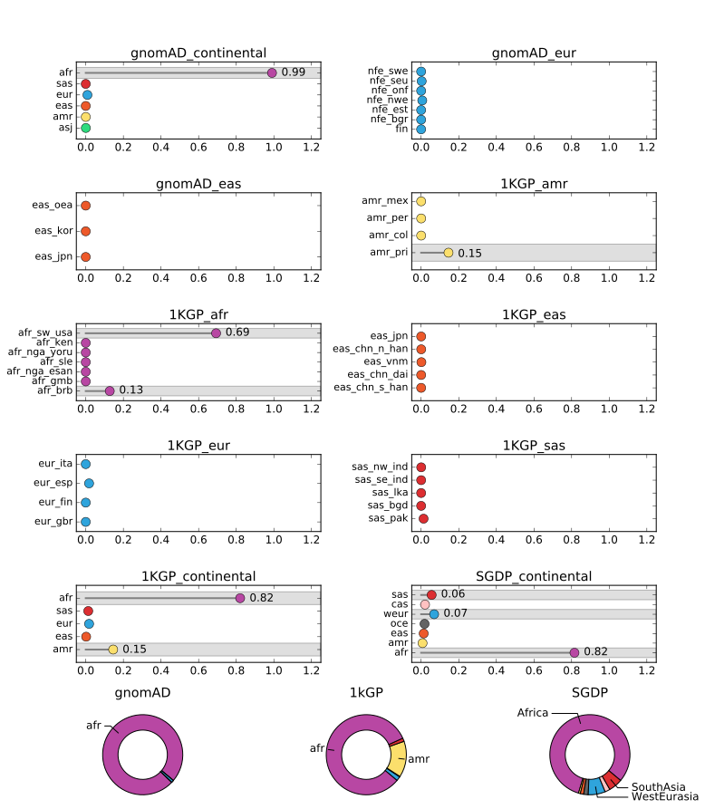

# SNVstory
Rapid and accurate ancestry inference using SNVs.


## Installation

SNVstory requires Docker to run. Download and install [Docker Desktop](https://docs.docker.com/get-docker/).

Build SNVstory.
```bash
cd snvstory
docker-compose build
```

Copy the resources into a location the container can find. This step will take some time, but only needs to be copied once.
```bash
aws s3 sync s3://path-to-directory dev/data/resource_dir/
```

## Output

### Ancestry Report
SNVstory returns a .csv report which includes the probabilities of each label. A .pdf is also returned, which summarizes these model probabilities in dot plots. The subcontinental model probabilities are weighted by the corresponding continental model result. 

E.g., in the following example case the gnomAD continental probability for the 'eas' label is 0, so the gnomAD East Asian subcontinental model probabilities are multiplied by 0 in the dot plot.





### UMAP
SNVstory also outputs a UMAP transformation of the user input sample on each set of continental model features.




## Execution

```bash
docker-compose run ancestry <arguments>
```

Example run with VCF on s3.
```bash
docker-compose run ancestry \
    --path s3://path-to-input-file \
    --resource "/data/resource_dir" \
    --output-dir s3://path-to-output-directory \
    --genome-ver 38 \
    --mode WES
```

Example run with VCF on local computer.
```bash
docker-compose run ancestry \
    --path "/data/path-to-input-file" \
    --resource "/data/resource_dir" \
    --output-dir "/data/path-to-output-directory" \
    --genome-ver 38 \
    --mode WES
```


